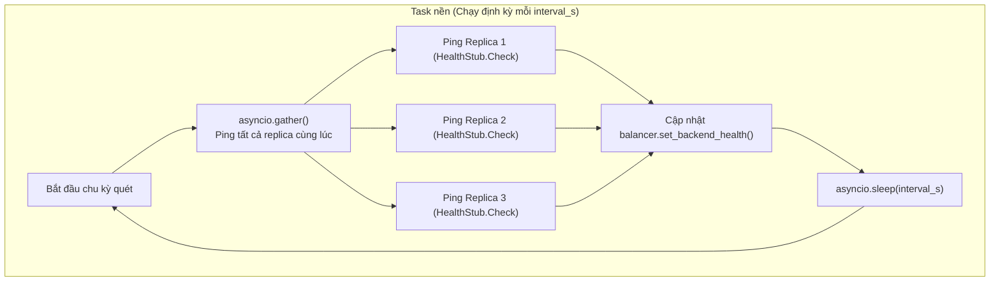

# Tài liệu Thiết kế Thuật toán Cân bằng tải (Load Balancing) — M1

Tài liệu này giải thích chi tiết nguyên lý hoạt động, cấu trúc mã nguồn và các quyết định thiết kế cho bộ cân bằng tải phía client trong file [`src/grpc_lb/balancer.py`](../src/grpc_lb/balancer.py) và [`src/grpc_lb/client.py`](../src/grpc_lb/client.py).

---

## 1. So sánh: Round Robin vs. Least Request

| Tiêu chí | Round Robin (`RoundRobinBalancer`) | Least Request (`LeastRequestBalancer`) |
|---|---|---|
| **Nguyên lý** | Xoay vòng đều qua các replica theo thứ tự 1-2-3-1-2-3... | Ưu tiên chọn replica đang có ít request chạy dở (in-flight) nhất |
| **Trạng thái lưu trữ** | Chỉ lưu ID của replica vừa được chọn lần trước (`_last_picked_id`) | Lưu số lượng request đang chạy dở của từng replica (`_in_flight: dict[str, int]`) |
| **Phù hợp nhất khi** | Các request có thời gian xử lý tương đương nhau | Khi có request nặng/nhẹ không đều hoặc có replica chạy chậm (Straggler) |
| **Độ phức tạp** | Rất nhẹ, $O(1)$ | Nhẹ, tìm min trong số replica active $O(K)$, $K$ là số replica |
| **Xử lý hòa (Tie-break)** | Không cần | Dùng Round Robin luân phiên giữa các máy hòa điểm |

---

## 2. Chi tiết Thuật toán Round Robin

### 2.1. Cơ chế xoay vòng
Gọi danh sách các replica đang khỏe mạnh là $A = [r_0, r_1, \dots, r_{n-1}]$.
* Giả sử lần trước vừa chọn replica tại vị trí index $i$.
* Lần tiếp theo, vị trí index được chọn là:
  $$\text{next\_idx} = (i + 1) \pmod{n}$$
* **Ví dụ:** Hệ thống có 3 replica `[R1, R2, R3]`:
  * Lần 1: Chọn `R1` (index 0)
  * Lần 2: $(0 + 1) \pmod 3 = 1 \rightarrow$ Chọn `R2`
  * Lần 3: $(1 + 1) \pmod 3 = 2 \rightarrow$ Chọn `R3`
  * Lần 4: $(2 + 1) \pmod 3 = 0 \rightarrow$ Quay lại chọn `R1`

### 2.2. Xử lý khi có Replica gặp sự cố (Unhealthy)
* Khi `R2` bị chết, danh sách active chỉ còn `[R1, R3]` ($n = 2$).
* Thuật toán tự động tìm vị trí của replica vừa chọn trong danh sách mới và tiếp tục xoay vòng giữa `R1` và `R3` mà không làm gián đoạn request.
* Khi `R2` phục hồi và báo `SERVING`, nó được nạp lại vào danh sách active và tự động tham gia vào vòng quay kế tiếp.

---

## 3. Chi tiết Thuật toán Least Request

### 3.1. Khái niệm In-Flight Request
**In-flight Request** là số lượng request mà Client đã bắn đi nhưng Server **chưa trả về kết quả** (đang truyền trên mạng hoặc đang nằm trong hàng đợi xử lý của replica).

```text
Client ────────── (Request 1 đang chạy) ──────────> [ Replica 1 ] (in_flight = 1)
Client ────────── (Request 2 đang chạy) ──────────> [ Replica 1 ] (in_flight = 2)
Client ───────────────────────────────────────────> [ Replica 2 ] (in_flight = 0)  <-- RẢNH NHẤT!
```

### 3.2. Quy trình lựa chọn 5 bước trong `pick()`
1. **Lọc replica sống:** Lấy tập hợp các replica đang active: $A$. Nếu $A = \emptyset$, trả về `None`.
2. **Tìm giá trị nhỏ nhất:**
   $$\text{min\_val} = \min_{r \in A} (\text{in\_flight}[r])$$
3. **Lọc danh sách hòa điểm (Tied Candidates):**
   $$C = \{r \in A \mid \text{in\_flight}[r] = \text{min\_val}\}$$
4. **Quyết định (Tie-breaking):**
   * Nếu $|C| = 1$: Chọn ngay replica duy nhất đó.
   * Nếu $|C| > 1$: Xoay vòng Round Robin giữa các ứng viên trong $C$ bắt đầu từ vị trí kế tiếp sau `_last_picked_id`.
5. **Tăng bộ đếm nguyên tử:**
   $$\text{in\_flight}[\text{chosen}] \leftarrow \text{in\_flight}[\text{chosen}] + 1$$

### 3.3. An toàn đồng bộ (Concurrency Safety)
Khi bộ phát tải bắn đồng thời 500 request trong cùng một mili-giây, nếu không có cơ chế khóa, nhiều coroutine sẽ đọc cùng giá trị `in_flight` cũ trước khi kịp tăng.
* Để giải quyết triệt để, hàm `pick()` được bọc trong `async with self._lock:`.
* Thao tác chọn và tăng bộ đếm diễn ra nguyên tử (atomic), đảm bảo không bao giờ xảy ra race condition.

### 3.4. Thu hồi bộ đếm trong `finally`
Bộ đếm **bắt buộc phải trở về 0** khi toàn bộ request hoàn tất.
Để đảm bảo điều này, trong hàm `client.execute()`:
```python
try:
    await stub.Execute(...)
except ...:
    ...
finally:
    await self._balancer.on_request_end(backend_id)
```
Dù request có thành công, gặp lỗi mạng hay bị timeout (`DEADLINE_EXCEEDED`), Python luôn luôn nhảy vào khối `finally` để trừ `_in_flight[backend_id] -= 1`.

---

## 4. Cơ chế Giám sát Sức khỏe ngầm (Background Health Check)



* **Không làm chậm luồng chính:** Task chạy độc lập trong Event Loop, luồng gửi request của client không bị gián đoạn hay chờ đợi.
* **Chuẩn gRPC Health:** Dùng đúng `grpc.health.v1.health_pb2_grpc.HealthStub`. Trạng thái `SERVING` nghĩa là khỏe mạnh; bất kỳ ngoại lệ nào (timeout, connection refused) đều coi là `unhealthy`.
